竟然搞白色字体隐藏，奶奶滴.

但是Mark还是小瞧我们了=v=

### example-1
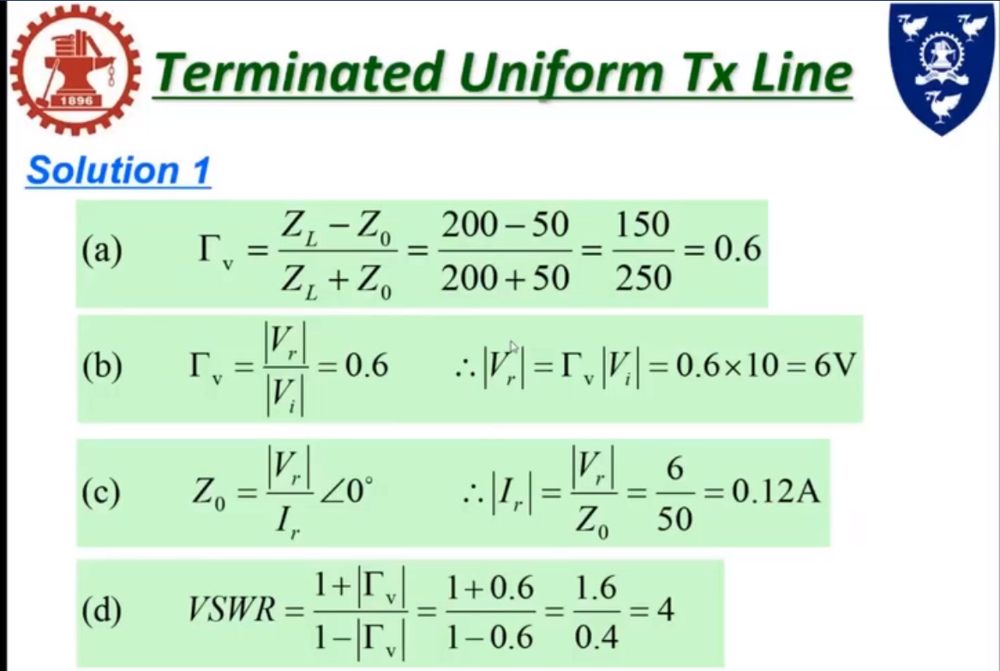

### example-2
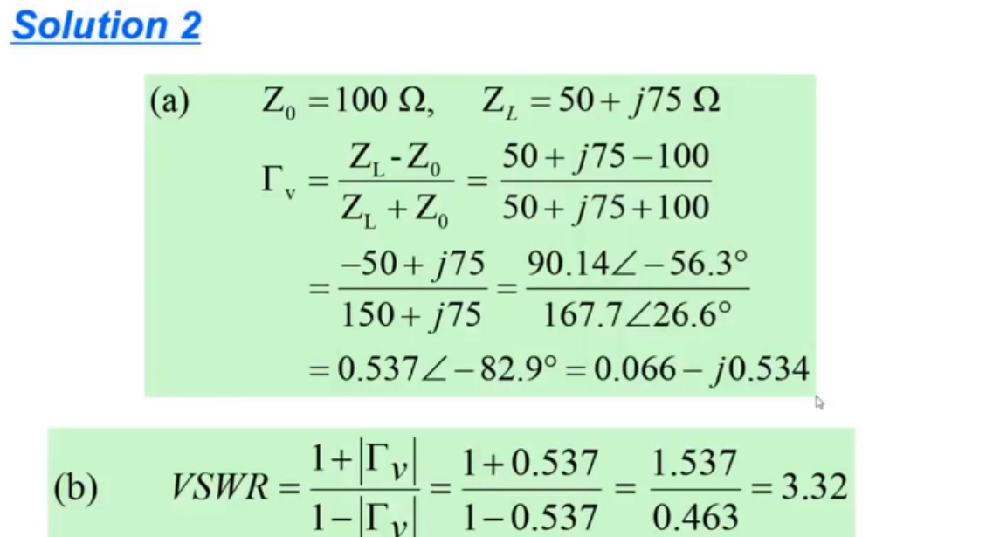

### example-3
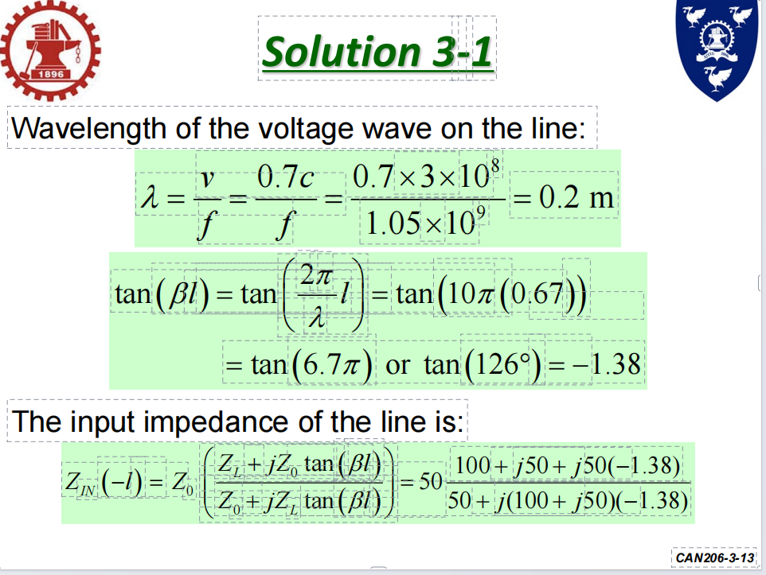
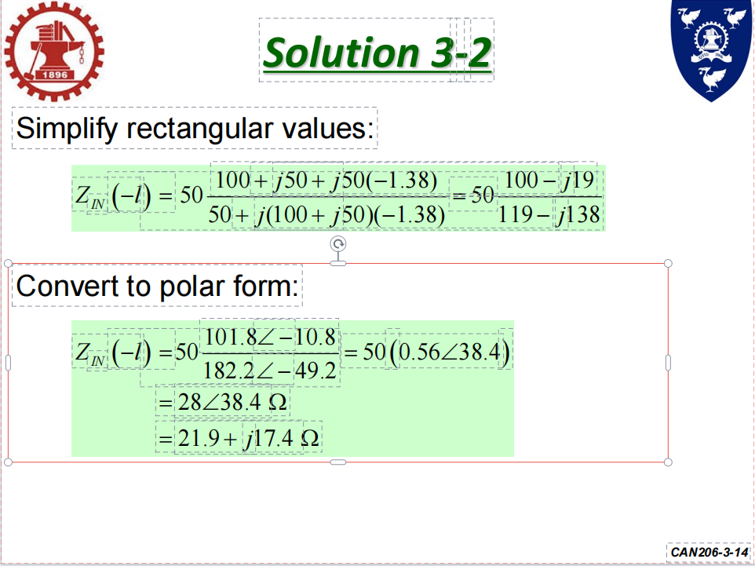

### example-4
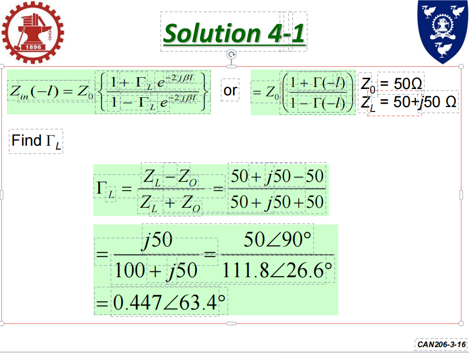
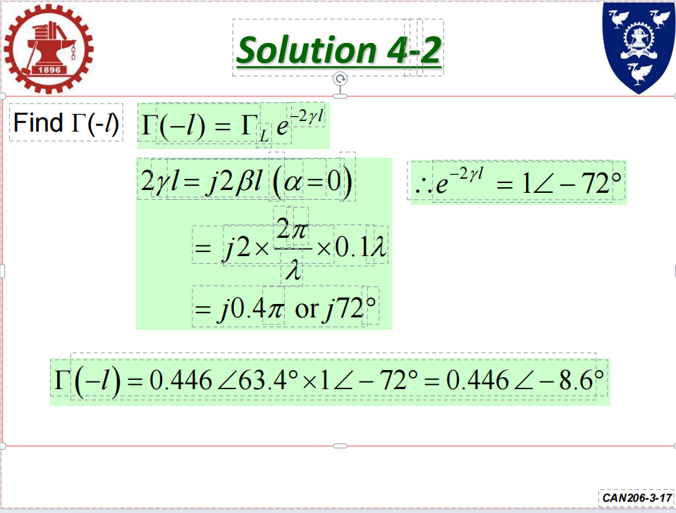

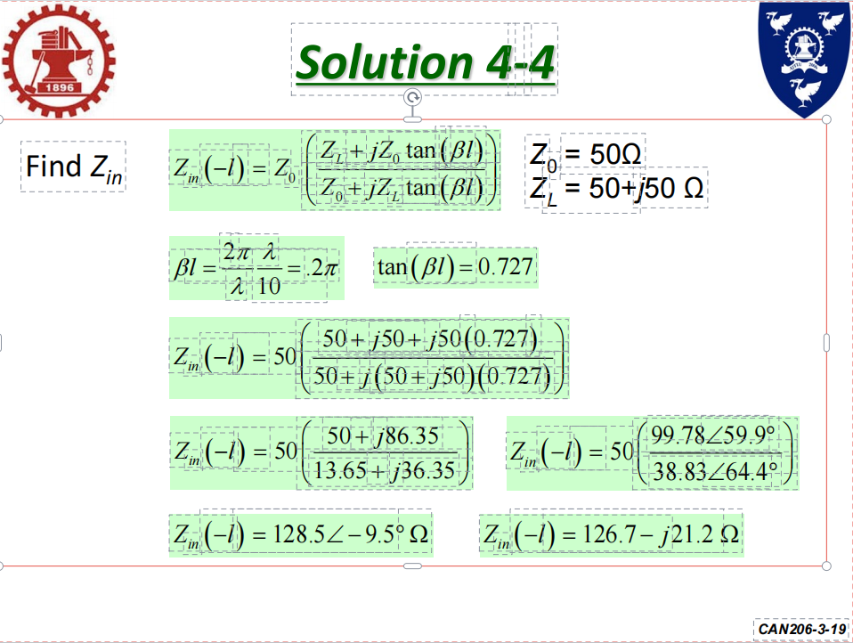

### exmaple-1-p.37
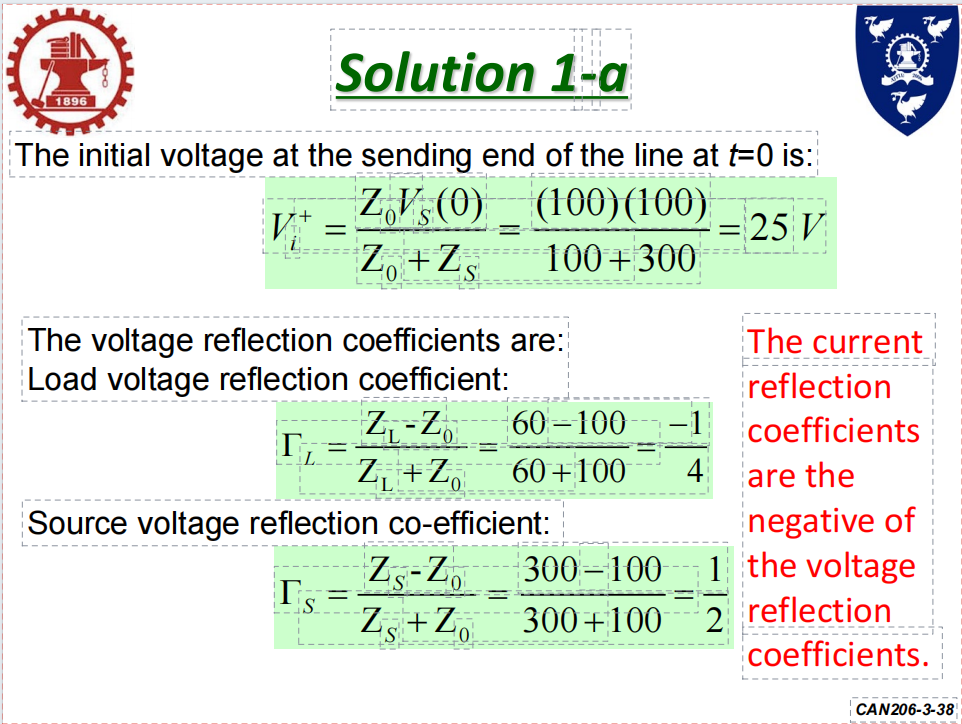
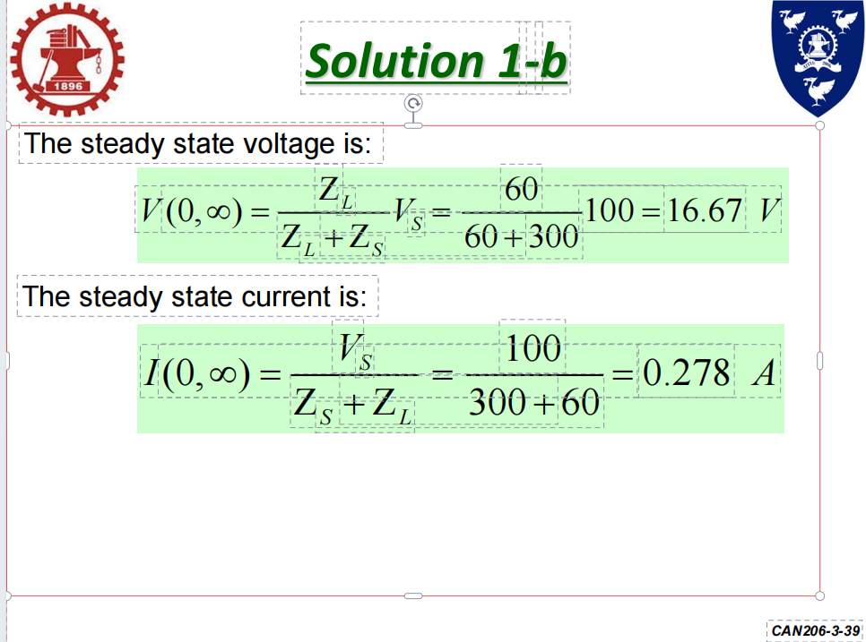

### example-2-p.40
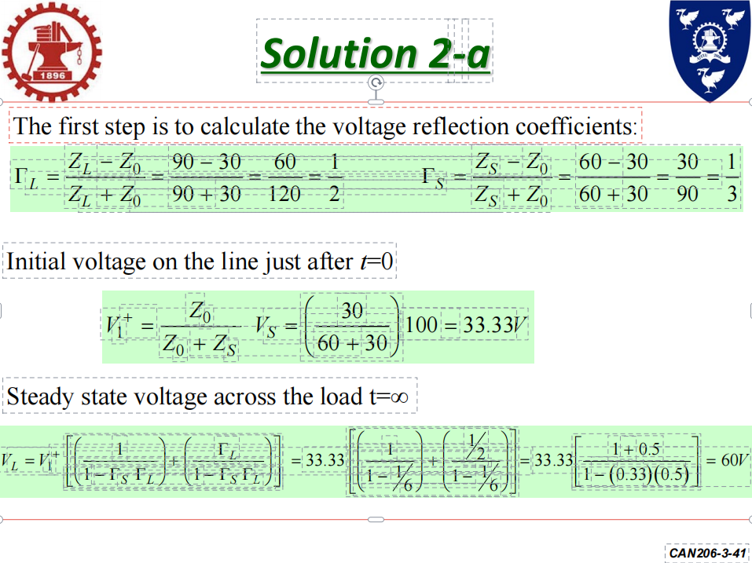
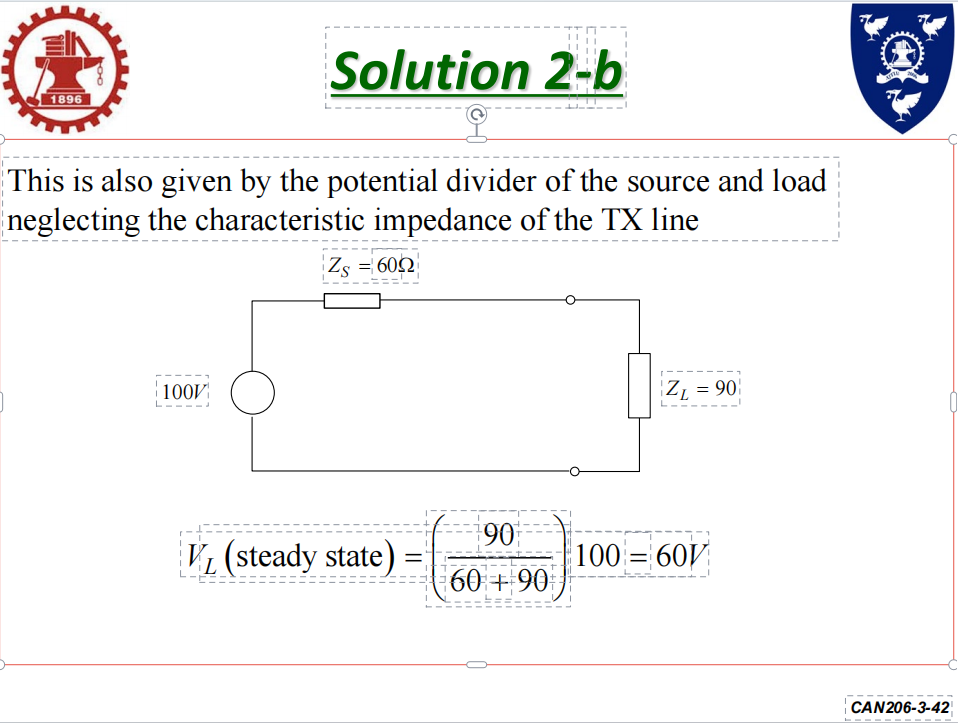

### example-3-p.43
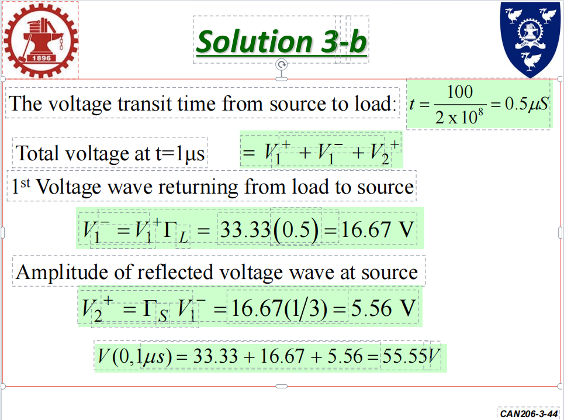
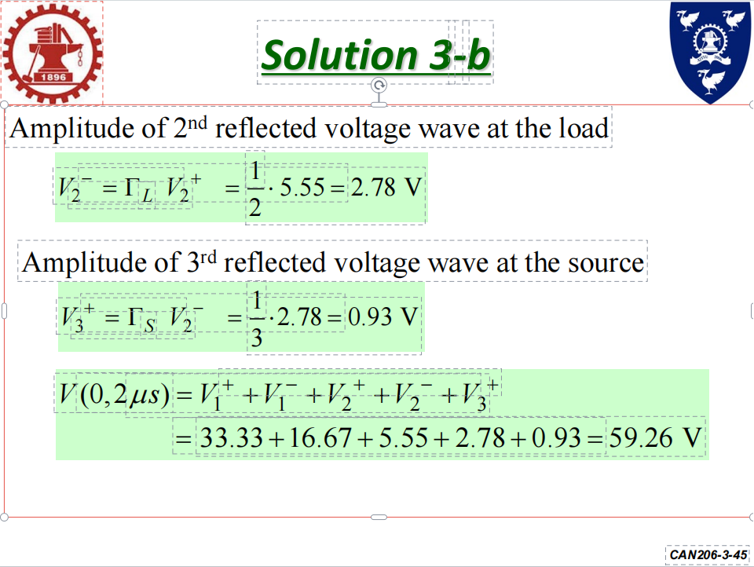
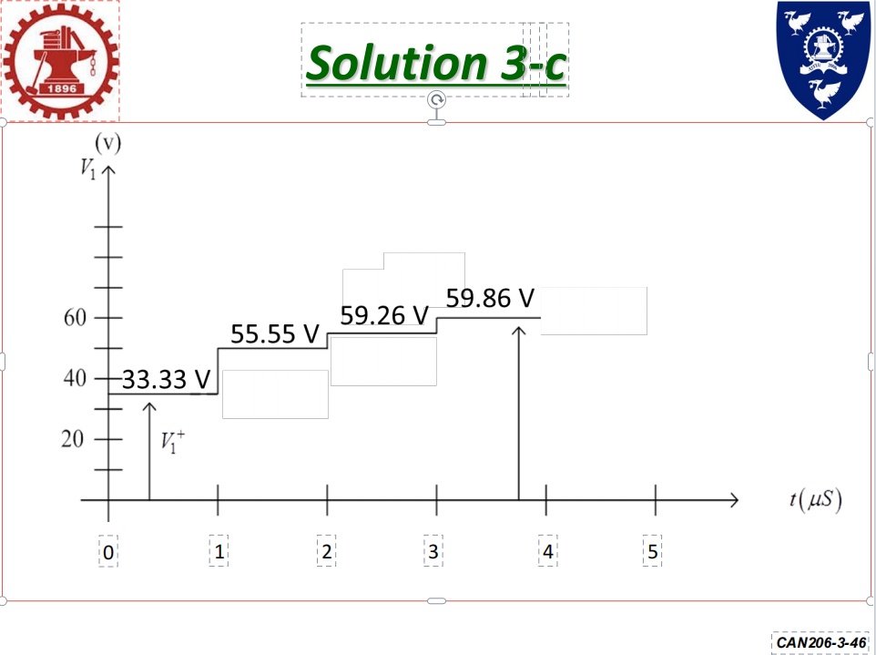

03月11日 09时01分

We get started. Although today's class should not be so difficult outcome, not should not have so much new material as last weekyou'll be pleased to knowWe're going to be talking about voltage and current transients. This is probably the easiest part of this module Hopefullythere won't be too much difficulty with it before we get into this week's materialLet's just have a quick reminder of what we did last week Last week we met the transmission line and we develop the transmission line as a circuit element which we can model using local elementsWe then developed equations that can describe how voted for changes along the waytrying to make sure about itI describe that at high frequency, this is particularly important because as the frequency we are operating athas a wavelength that becomes comparableclose to or even shorter than the transmission line that is traveling alongthen we have directly variation in voltage and current.

我们开始吧虽然今天的课不应该这么难。结果，不是不应该有像上周一样多的新材料你会很高兴知道我们要讨论的是电压和电流瞬变。这可能是最简单的部分。这个模块的希望如此用它不会有太大的困难。在我们进入本周的材料让我们只有一个快速提醒我们上周做了什么。上周我们遇到了输电线路，我们将传输线开发为电路元件我们可以使用局部元素进行建模。然后我们开发了方程，可以描述如何投票变化一路走来试图确保这一点。我描述了那个在高频率下，这一点尤为重要，因为作为我们正在运行的频率有一个波长变成可比较的接近甚至短于沿其行进的传输线然后我们直接得到电压和电流的变化。

So we must consider the transmission line as a certain elementnot just the conductor We developed the concept of the reflection coefficient. So I set out with the transmission line, a warning that had a generatorAt the other end, initially, it had nothing we developed the idea that a wave will travel from a source, the generator along the transmission lineIt will meet the end of the lifeAnd depending what is therewe may get a reflection or we may notIf we do get a reflection, this means we have two waves traveling in opposite directions along the lineThe weeks are coherentThat means all the same frequencies, exactly the same These waves will interfere with each other of the expressions we developed describe it is very ancientHow do they interfere with each otherTowards the end of the class? Last week, we were looking at input impedance. I said that we can consider the transmission line with its low as a single lumped element impedance

所以我们必须将传输线视为特定元素不只是指挥。我们发展了反射系数的概念。所以我带着输电线，一个有发电机的警告在另一端，最初，它什么都没有我们提出了一个想法，即波将从一个源，即发电机，沿着传输线传播。它将迎接生命的终结。取决于那里有什么。我们可能得到反映，也可能得不到。如果我们确实得到了反射，这意味着我们有两个波沿着这条线以相反的方向传播。这几周是连贯的。这意味着所有相同的频率，完全相同这些波会互相干扰。我们开发的表达式形容它很古老。它们是如何相互干扰的？快下课的时候？上周，我们在看输入阻抗。我说我们可以考虑传输线的损耗作为单个集总元件阻抗

And then if we attached that impedance the input or to the the signal sourcesingle source, but don't know any differentFinally, last week, I developed an expression that describes reflection coefficient at any position on the transmissionThat's very quickly have a look at what I've just described again That is our system. That is what we will look at the same movie We have a simple generator sourceYou have a transmission line, and we have a load at the endThe expressions that we generated, we derived, please remember, I do not require you to derive expressions of no interestThe derivations in the slides. Are there to help you understand where these solutions came fromThey are not there because I expect you to do the therapy These are the results we got to in developing the Telegraph equations that describe how voltage and current very along the length of the lineThey are constructed in array of a forward traveling waveThis is a former traveling way because the negative sine of the exponential tells me that is a full problem

然后如果我们把这个阻抗输入或到信号源单一来源，但不知道有什么不同最后，上周，我发明了一个表达来描述传输上任何位置的反射系数那很快，请再看一遍我刚才描述的内容。这就是我们的制度。这就是我们要看的同一部电影。我们有一个简单的发电机来源。你有一条传输线，我们在末端有一个负载。我们生成的表达式，我们推导的表达式，请记住，我不要求你推导没有兴趣的表达式。幻灯片中的推导。是否可以帮助您了解这些解决方案的来源他们不在那里是因为我希望你去做治疗。这些是我们得到的结果。在发展电报方程时描述了电压和电流如何沿着这条线的长度它们是在数组中构造的。正向行波的这是以前的旅行方式，因为指数的负正弦告诉我这是一个完整的问题。

The purpleI think we can call it purpleThe purple waves described here are ways traveling in the opposite direction, in the negative Z direction. They are positiveAnd that there will be the other important thing about these equations is that in terms of voltagesthe forward traveling way, the way traveling in positive, said, and the way of traveling in negative instead add togetherWhen they meet, they interfere and they act together while there is a subject. The currentHowevertraveling in opposite directions, they subtract from each other minus these equations allow me at some position, said along the transport in linedetermine what is the total voltage what is the total current at that.on the transmission lineThe fact could wait for the the way of traveling in negative said is generatedby the forward waythis is what I've just described. We have our transmission linemy generator, that is the only thing generating energy inDon't you think supplying powerIt provides a way all of the transmission line travels over the transmission law is reflected at the load, and the wave travels back down the transmission line

紫色的我想我们可以叫它紫色。这里描述的紫色波是以相反的方向传播的，在负Z方向。他们是积极的会有的。关于这些方程的另一个重要的事情是是用电压表示的吗？正向旅行的方式，正向旅行的方式，说，和负向旅行的方式加在一起当他们相遇时，他们互相干涉，当有一个主题时，他们一起行动。电流然而它们以相反的方向行进，彼此相减。减“这些方程允许我在某个位置，”沿着运输说。排队确定总电压是多少总电流是多少在那。在传输线上。事实可以等待负游之道说已生成以前进的方式这就是我刚才所描述的。我们有我们的传输线我的发电机，那是唯一能产生能量的东西你不认为提供电力它提供了一种所有传输线路的方式。穿越传输定律在负载处反射，并且波沿着传输线传播回来

There is only actually one source hereThe forward wave gives rise to the reflected waveThey are related They are related by something we call the reflection of itNow, in our because we are clever because people who came before September to make a lot of projects easyWe choose position, the location in our system, was that equal zero to being alone and of the transmission linenot the input endbut the load is and the load in the forward traveling way, because is just equal to its magnitude inside the reflected way we will describe, as, we know, minus some magnitudeand some angle represented by the exponential termDon't know if you can remember what this Greek symbol is called this onenot at allJust wondering if you can prevent the reflection coefficient is described as the reflected wave divided by the forward wavethe reflection coefficients as a magnitude minus divided by zero plus

这里实际上只有一个来源。前向波产生反射波他们是有关系的它们通过一种我们称之为它的倒影现在在我们的因为我们很聪明。因为九月之前来的人让很多项目变得简单。我们选择位置，在我们的系统中的位置，等于零是单独的和传输线的。而不是输入端但负载是而正向行驶方向的负载，因为正好等于它内部的大小。反射的方式我们将描述，因为，我们知道，减去一些震级还有一些角度用指数项表示不知道你是否还记得这是什么希腊符号叫这个。一点也不只是想知道你是否能阻止反射系数被描述为反射波除以前进波作为幅度的反射系数负除以零加

It has an angle, possiblyWe can say it always has the angle that I look at youThe limits of the reflection coefficient If the reflected wave is generated or created by the forward wavethen it definitely cannot get bigger than the forward wasteThere is nothing supplying energy into the system of the local the reflection coefficientthe size of it for that large capital gamma L can only be a value between zero and oneThe magnitudeeither I get all of the forward ways reflected I get part of the forward way reflected I get none of them all the way backIf that value was greater than one what you're seeing is the reflection is larger What is arriving that is not possible unless this is an active element of the lawAnd in our our world we would lovely not be considering acting elementsWe went one stage further in our derivation of gamma L, the reflective coefficients, we described it in terms of the impedance is of the system

它可能有一个角度。我们可以说它总是有我看着你的角度。反射系数的极限如果反射波是由前进波产生或创建的，那么它肯定不会比向前的浪费更大。没有任何东西向当地的系统提供能量。反射系数它的大小对于大写字母Gamma L只能是介于0和1之间的值震级要么我把所有的前进方向都反映出来我得到了前进道路的一部分。我没有得到他们所有的方式回来如果该值大于1你看到的是反射更大。什么是不可能到达的？除非这是法律的积极因素。在我们的在我们的世界里，我们不会考虑表演元素。我们进一步推导了反射系数γL，我们用阻抗Is来描述它。系统的

So said L, the impedance of the lawand said zero, the impede the characteristic impedance of the transmission lineThey are the same thingHaving gamma L allows us to rewrite our first two expressions.  We have an expression for visa, which now describes the reflected wave in terms of the reflection of I said, also describes the reflective waypurple one in terms of the reflection coefficientHorrible textureAny questions about those before? All right. ByebyeWe are familiar from last semester a little bit We derived expressions to describe input impedance for the transnational law. So that is the people's looking into the transmission line We saw that the input of pieces related, not just to the impedance, is in the system7, 10, 0and also relates to the frequency we are operating at and the length of the transmission lineThey all impact the impedance

法律的阻抗L如是说。以及所述零、阻特性阻抗输电线路的它们是一回事。有了Gamma L，我们可以重写前两个表达式。我们有一个VISA的表达式，它现在描述了反射波的反映方面我说，也是描述反射方式就反射系数而言，紫色的可怕的质地关于之前的那些有问题吗？好吧拜拜我们从上个学期开始就有点熟悉了。我们推导出表达式描述跨线法的输入阻抗。这就是人们对输电线路的研究。我们看到，系统中不仅有与阻抗相关的输入7, 10, 0, 也与我们工作的频率和传输线的长度有关。它们都会影响阻抗

We see. Who said it is the impedance that I would see if I looked into the input of the transmission lineEffectively, I could take the transmission line and the load remove them and replace them with another loved element in pins that would from the generator, look exactly the same as the transmission line with the lawIf you think about itthis now looks a little bit like the generator and the loadThe loan has in the original circuit, the load has a reflection coefficient Why Kant said it looked like it has a reflection coefficientIndeed, it can. So for every position along the transmission lineI can calculate and equivalent in quantityAnd every equivalent input impedance has an associated reflection coefficient trying to have reflection coefficient for impedance and any distance along the translation lawJust to make that clear if I take this system and I want to know the impedance and minus L over two instead of the very input about the slack

我们看到谁说的如果我查看传输线的输入，就会看到这个阻抗。实际上，我可以控制传输线还有负载把它们拿走并将其替换为别针中另一个可爱的元素那会从发电机看，与输电线的规律完全一样。如果你仔细想想。现在看起来有点像发电机和负载。贷款有在原始电路中，负载具有反射系数为什么康德说它看起来有反射系数？的确，它可以。所以对于每一个沿输电线的位置我可以计算且数量相当。并且每个等效输入阻抗都有一个关联的反射系数尝试将反射系数用于阻抗和沿平移规律的任何距离。我只是想说清楚。如果我拿这个系统来说，我想知道阻抗和负L除以2，而不是输入。关于松弛

This is minus M over twoThat's perfectly fine. I just substitute that value into my expression for a piece calculating theseI can then calculate and associated reflection coefficientThese are just equivalent circuits. These are not realIt is just what our transmission line system looks like, and it is how we are able to analyze transmission line systemI left you with some examples to do last weekI'm not optimistic, but let's ask how many people have attempted these examples? And the five or six I do not ask that you do very much in this classI don't give you lots of homework to do. I don't expect a lot of you of these questions are very easyIf I suggest that you try them in your own time, that's a very strong suggestionRegardless, we will go through the examples I leave for you every week in the following weeks later

这是负M除以2。那完全没问题。我只是把这个值代入我的表达式中计算这些然后我可以计算相关的反射系数。这些只是等效电路。这些不是实际的这就是我们的输电线路系统的样子，这就是我们如何能够分析传输线系统上周我给你们留下了一些例子。我并不乐观，但让我们问问有多少人尝试过这些例子？还有五六个我不要求你做太多。在这个班里我没有给你很多作业要做。我对你的期望不高。这些问题都很容易。如果我建议你在自己的时间里尝试它们，这是一个非常强烈的建议。无论如何，我们将在接下来的几周里，每周都会讨论我留给你们的例子。

But if you don't try them firstyou are not going to get anything out and be going through the solution. Is that it is better, much betterWe all learning that you attempt these at the right time What's the example say? So if you have AA signal of 10 volts that is applied to AA 50 loan quartial cable that being said, zero is 50 ohmsIt is terminated with a 200 home loans who said L is $200 I want to calculate all thingsVoltage reflection coefficient magnitude of the reflected voltage partnership is reflected current and the vsw one voltage standing wave ratio for those of you to come backLet's look at the first one voltage reflection coefficients. I've just given you the next expression, which can calculate this in terms of system. Impedance is M il of gamma V gamma L to match the they are the same thingIs equal to zl minus N zero divided by NL must set you that metal is 200 is 50

但如果你不先试一试你不会得到任何东西，也不会通过解决方案。那是好多了，好多了我们都知道你在正确的时间尝试这些。这个例子说明了什么？因此，如果你有10伏的AA信号，应用于AA 50贷款四分之一电缆，也就是说，零是50欧姆。它以200美元的住房贷款终止，谁说L是200美元？我想计算所有的事情。电压反射系数反射电压的大小伙伴关系反映在当前和VSW中电压驻波比为那些你回来让我们来看看第一个电压反射系数。我刚刚给了你下一个表达式，它可以根据系统来计算。阻抗为伽玛V伽玛L的M IL，以匹配它们是一回事。等于ZL减去N零除以NL必须设置那个金属是200是50

Anybody you wish to give me a number0.6 is a good number Having that value allows us to calculate part B That's the magnitude of the reflection coefficient. That was the magnitude of the reflected voltage.  What does the reflected voltage? Or what does the reflection coefficient tell us those how the incident voltage is reflected as the reflective thought Gamma V is really the reflected voltage divided by the incidentalYou already calculated that 0.6We know that the incident voltage as a value of ten votes the reflected voltage must be sixAnybody is having difficulty with this sincerely hoping notDoes this really should be very simpleHow about the reflected currentThe idea isI sincerely hope at this stage, you understand their own slowbut sincerely over. ByebyeRemember that the characteristic impedance of the line relates either the forward voltage to the forward current or the reflected voltage to the reflected earth

有人想给我一个号码吗？0.6是个不错的数字。具有这种价值允许我们计算B部分这就是反射系数的大小。这就是反射电压的大小。反射电压是多少？或者反射系数是多少？告诉我们那些怎么入射电压被反射作为反思的思想伽玛V真的是反射电压除以附带的你已经计算出0.6了。我们知道入射电压作为十票的价值反射电压必须为6有人在这方面有困难吗？真心希望不是这真的应该很简单吗？反射电流如何？这个想法是我真心希望在这个阶段，你慢慢明白了自己。但真诚地结束了拜拜记住，线路的特性阻抗与正向电压和正向电流有关，或者到反射大地的反射电压

6÷50 gives me the size of the left firstWhat you are. So finally, the pswi didn't give you an expression in my introductory slides for thisIt is, again, something we derived last weekI might as well just give it to you at this point,  one plus the magnitude of gamma divided by one minus oneYou have the value of gammaAgain, just look in the numbers We get a value of four Yes, you areThe limits of the swr is thatBecause gamma of the magnitude of gamma has a limit between zero and oneThen vsw are most out of it between one and infinity made for this expertOr if you calculate avsw onethat is less than oneYou've done something wrongIf you calculate a negative system, you are involved or somethingAny questions about these solutions before we continueThere is another exampleThere's more complicated. Anyone? NoOkay, this is more difficultThis time we have 100 old transmission line, in other words, says zero is $100

6÷50先给我左边的大小。你是什么。那么最后，在我的介绍性幻灯片中，PSWI没有给你一个表达。这也是我们上周得出的结论。在这一点上，我还不如直接给你，1加γ的大小除以1减1。你有伽马值。再一次，看看这些数字。我们得到的值是4。是的，你是SWR的限制那是因为Gamma的大小的Gamma具有0和1之间的限制那么VSW在1和无穷大之间是最大的专为这位专家打造或者如果你计算AVSW 1那还不到一个。你做错事了。如果你计算一个负系统，你就参与了什么。在我们继续之前，关于这些解决方案还有什么问题吗？还有一个例子。还有更复杂的有人吗不好吧，这个更难。这次我们有换句话说，100条旧传输线表示零是100美元。

It is terminated by a complex load50 plus G 75Again, we want the voltage reflection coefficient gamma The bsw are we're going to use the same expression to calculate out, then L minus seven zero divided by 7 plus 0I expect you to be able to handle complex numbersthe case of taking the values, the Z zero and said L,  plugging them into the same equationThis equation we will see every single week remaining in this semester. I expect you to remember this equation. It should be burned into your brain if you are unable to make this kind of calculation, then you should make an appointment to see me so that I can at least show you what you should do itor explain what you should doThere are multiple ways of solving this to be FrankI suggest you learn how to use your calculator to solve thisAnd apologies, I forgot to think which calculated you're allowed

它由复杂负载终止50加G 75同样，我们需要电压反射系数γBSW是我们将使用相同的表达式来计算，然后L减去70除以7加0。我希望你能处理复杂的数字取Z为零和所说的L的值，将它们代入同一方程的情况我们每周都会看到这个等式。留在本学期。我希望你能记住这个等式。它应该被烧进你的大脑。如果你不能这种算计，那你应该约个时间来见我。这样我至少可以告诉你你应该怎么做。或者解释你应该做什么。有多种方法可以解决这个问题。坦白地说我建议你学习如何使用计算器来解决这个问题。抱歉，我忘了考虑你被允许的计算方式

That's the problem for the companyBut it is not the number that can handle complex numbers directlyYou will have to know how to calculate this kind of thing by that.  Thank you We have a valued OThe reflection coefficient note it has a a size is between zero and one.  I have some confident in my value for reflection coefficients it has an angle 97°in this particularI don't mind whether you quotes a reflection coefficient in rectangular formatSomething plus a minus J is something all in all a format, the size and the angle. It doesn't matterThey both are the same thingNote that reflection coefficient has no unitIt shouldn't have a unitIts definition was voltage divided by voltageThere is no unit for thatYes, we are It's the same expression. You just see know that gamma here is the magnitude of gamma onlyThis is not a complex expression evaluating is only dealing with real valueThe magnitude of gamma, again, is.537 from the bowl of all

这就是公司的问题。但它不是可以直接处理复数的数字。你必须知道如何用那个来计算这种事情。谢谢我们有一个有价值的O反射系数注意它有一个大小在0和1之间。我有一些有信心的在我的反射系数值中它有一个角度。在这个特定的97°我不介意不管你引用矩形格式的反射系数加A减J就是格式，大小和角度。这不重要它们都是一回事。请注意，反射系数没有单位它不应该有一个单位它的定义是电压除以电压没有那个单位。是的，我们是这是同样的表达。你只需要知道这里的伽马只是伽马的大小。这不是一个复杂的表达式求值只处理真正的价值。伽马的大小也是.537。从所有人的碗里

There's another two examples you'll be pleased for those of you who didn't attendcheering lots of English to readGood eveningBut really, what you need to do here is just pull out the relevant numbers we have a signal generating. It is operating in 1.05 beginners gigahertz times ten to the power of what? 91.05×10raised to the power of9. It is it has its own internal impedance of 50 years. This is of no importance for it has an amplitude of 10 voltsIt has a low of 100 plus G 15 attached to it through the transmission line that is 50 ohmssaid 050 shitThe length of the line is given in centimeters 67 centimeters We're told that the velocity of the wave along the line be is equal to 0.7 Cwhere C is the speed of light in a vacuum

还有另外两个例子，你会高兴的。对于那些没有参加的人欢呼有很多英语要读。晚上好但实际上，你需要做的是找出我们所拥有的相关数字。信号产生。它在1.05初学者中运行千兆赫乘以十的幂次方是多少9, 1.05×10的9次方它是它有自己的内部阻抗50年。这对…来说并不重要它的振幅为10伏。它有100加G 15的低点。通过50欧姆的传输线连接到它说050狗屎线的长度以厘米为单位。67厘米我们被告知的速度沿线的波浪是等于0.7℃其中C是真空中的光速。

We remember the number that really relates to that3 times 10 to the power 8 meters per second is the speed of light in a vacuum specifically we want to find the input impedance to this slideLet's draw the circuit. I strongly recommend that if you were ever given a question that contains lots of textDraw the circuit as simple as the circuit might be, it will make sure you do not make any stupid mistakesAll the way is going to draw the thirdBut being asked, what is the input impedance so that it means looking into the transmission line. Here we're going to use this expression. Actually, we're going to use a number of expressionBut againthey are going to result in complex number calculationsYou need to be familiar The first thing we need to do is calculate wavelengthIf we go back to this equationin here, we have a value presented. We have a value present zeroReturn is too high divided by lambda

我们记得真正与此相关的数字。3乘以10的8次方每秒米是真空中的光速。我们想找出输入阻抗。到这张幻灯片让我们画出电路。我强烈建议如果你被问到一个问题包含大量文本的把电路画得尽可能简单，它会确保你不会犯任何愚蠢的错误。一路都是要画第三的。但当被问到输入阻抗是多少时，这意味着要看传输线路。这里我们将使用这个表达式。实际上，我们将使用许多表达式但是再一次它们将导致复数计算。你需要熟悉。我们要做的第一件事是计算波长。如果我们回到这个等式在这里，我们提出了一个价值。我们有一个值为零。除以lambda后的返回值太高

We have a value for The first thing we need to do is determine what is lambda.  We can find betaLambda is the velocity of the wave on the line. We were given that 0.7 C divided by the frequencyWe were given that lambda here is 0.2 metersWe can now find the value talent, beta LThese are two pile of lambdamultiplied by L.  We have numbers for all of thoseThat gives us a ton of 126°or6.75Again, be very careful when you use your calculator that you are using the correct units If you are putting it into high divided by lambda times Lthen the unit is likely to be radiance that you need not°, so be very carefulWhat value you might use that, what unit you are using in your tablet

我们有一个价值我们需要做的第一件事是确定什么是λ。我们可以找到贝塔。λ是线上波的速度。我们得到了0.7摄氏度除以频率我们得到了那个。这里的λ是0.2米。我们现在可以找到价值天赋，贝塔·L。这是两堆拉姆达。乘以L，我们有所有这些的数字。这给了我们大量的126°或6.75再次，当你使用计算器时要非常小心。您使用的是正确的单位如果你把它放在高除以λ乘以L然后是单位很可能是你不需要的光芒，所以要非常小心。你可能会使用什么值，你在平板电脑中使用什么单位

We now have a numberWhat can be to LWe've been so that you have everything into our equation for said in. I think I find it so funny. Thank you so muchI realize I'm old, I thought I realized I realized that when I was young, we didn't have phones and iPods,  et ceteraBut the sheer laziness involved in taking a photograph instead of actually writing it downIs there onFor me, it's unimaginable. You are as much as it may be an old fashioned way of doing things, writing things down will give you a better feeling for what you were doingthen taking a photograph that you are likely never to look at againThat is just my advice to youThe time you up to you, how do you perform thisI know that one person is taking a video of the entire thingwhich I find quite funnybecause I will provide the video at the end of the class

我们现在有一个数字。对我来说能是什么我们已经让你把所有的东西都放进我们的等式里了。我认为我觉得很有趣。非常感谢我意识到我老了，我以为我意识到我意识到当我年轻的时候，我们没有手机和iPod，等等但是纯粹的懒惰拍照而不是把它写下来。有没有在对我来说，这是难以想象的。你是尽管这可能是一种过时的做事方式，但把事情写下来会让你对自己所做的事情有更好的感觉。然后拍一张你可能再也不会看的照片。这只是我给你的建议。时间由你来决定，你是怎么做到的？我知道有一个人正在拍摄整个过程的视频。我觉得很有趣。因为我会在课程结束时提供视频。

So that's also interesting Anyway,  we end up with this. We substituted in all of our numbers We have to solve that simplified by adding and subtracting together the real parts and imaginary partsMy personal preference is to convert the rectangular form to polar form, because dividing all the numbers is easier than dividing rectangular numbers Then if I wantI can find the final impedance as a rectangular number. But againI don't care as a solutionwhether you give me an impedance and fuller formats or in rectangular formthey are the same number, makes no differenceAny questions about that so farThe final example, I let you get very similar exampledifferent low value, different length of lifeWe're going to solve this using a number of expressions, not just one expression, just to show that they all produce the same answer Again, we have a transmission line, 50 oldWe have a low 50 plus J 50, and we have the length of the lineThat is actually all we need to solve for setting him

所以这也很有趣。不管怎样，我们以这个结束。我们把所有的号码都换掉了。我们必须解决这个问题。通过将实部和虚部相加和相减来简化我个人倾向于将矩形形式转换为极坐标形式，因为除以所有数字比除以矩形数字更容易。那么如果我想我可以用一个矩形数字来表示最终的阻抗。但是再一次我不在乎这个解决办法。你是否给我一个阻抗和更完整的格式或呈矩形形式它们是相同的数字，没有区别。到目前为止有什么问题吗？最后一个例子，我让你得到非常相似的例子。不同的低值，不同的寿命我们将使用多个表达式来解决这个问题，而不仅仅是一个表达式，只是为了表明它们都产生相同的答案。同样，我们有一条50年前的传输线我们有损失50加上J50，我们就得到了直线的长度。这实际上是我们设置他所需要解决的所有问题。

You might wonder what is the frequencyFrequency is not an issue in this case, because the length of the line is stated in wavelengths that makes our life easier and results from the case Here I'm using the alternative expression we derived, or would it be in terms of reflection coefficientLet's see how to apply this equation insteadFirst of all, we find gamma L, the reflection coefficients at the lowWe have set L, we have set zeroplugging in the numbers, we get a value for reflection voltageYou want to take a program as is your desireNow we have the reflection coefficient. We can find gamma, the reflection coefficient at the input to the transmission line. But this is what I said was AA generalized form of reflection voltageWe calculated at the low, the exponential term here allows us to move the reflection coefficient from the load to the input of the transmission lineassuming because we haven't been told otherwisethat the line is lossless

你可能想知道频率是多少。在这种情况下，频率不是问题，因为线路的长度以波长表示这让我们的生活更轻松。以及案件的结果在这里，我正在使用我们得到的另一种表达，或者它会是就反射系数而言让我们来看看如何应用这个等式首先，我们求出伽玛L，即低层处的反射系数我们设置了L，我们设置了零代入数字，我们得到反射电压的值你想参加一个节目。就像你的愿望一样现在我们有了反射系数。我们可以求出伽玛，即传输线输入端的反射系数。但这就是我所说的反射电压的广义形式。我们在低点计算，这里的指数项允许我们移动反射系数从负载到传输线的输入假设因为我们没有被告知其他的这条线是无损的

That means Alpha of my little gamma is zero. How are youTwo little gamma L reducers to to detail the J J to be the I have a value for LIt's 0.1 lambda Peter two pi over lambda. The lambda is cancelled We didn't need to know what is the frequency in this particular instance. And we end up with the value of angle 72°of.45That simply means to move my reflection coefficient from below to the input of the lineAll I'm doing is changing the angle of the reflection coefficient That should make sense because the line is losslessThe relative size of the incident wave and the reflected wave will not change as I moved along the line we can find our ll. They are my childrenGamma at minus a by multiplying gamma L by ourfor example that tells us reflection coefficient at the inputthe magnitude of gamma L has not changed just in space.

这意味着阿尔法我的小伽玛是零。你好吗两个小Gamma L减速器到细节J, J为我有L的值它是0.1λ彼得2π除以λ。Lambda被取消我们不需要知道这个特定情况下的频率是多少。我们最终得到了角度的值45度的72度那只是意味着移动。我下面的反射系数到线路的输入我所做的就是改变反射系数的角度。这应该是有意义的，因为这条线是无损的相对大小入射波和反射波不会改变当我沿着线移动时我们可以找到我们的LL, 他们是我的孩子。负A时的伽马通过将伽玛L乘以OUR比如说这告诉我们输入端反射系数伽玛L的大小没有改变只是在太空中。

And okayNow we take our gamma value and plug it into the expression for input impedance. Again, another complex number calculationI'm going to go through it step by stepYou should be able to do the we get down to a final value for input impedance. And all of all rectangular form doesn't matterThe unit matters its impedance, its ownAny questions about thatI'm not going to read through thisI've used the expression we use, for example, three to solve the same problem, just to show that we get exactly the same answer The two expressions you have for input, it means the one with the tans in it, and the one with the reflection coefficient it is doesn't matter which one you use, you will get the same answerAnd next weekwe will solve this problemAgainBut in a completely different way that is easier than this and a lot faster than this That's all of spent 40 minutes doing all of last week's thingsNow we're going to talk about this with first Very goodI mentioned in the beginning, we're going to be looking at transients on transmission linesThis is a particular importance to the est studentIt's really where a business we'll develop the idea of transients, though. I expect you to know what a transient is to find out in the momentWe'll consider how multiple reflections happen on the transmission line and what the impact of votedIi will introduce something called a voltage bounce diagram Finally, we'll spend a little bit of time looking at non sinusoidal singularThis is really for information more than anything elseThis should be quite straightforward Last week. And so far this morningwhat we've been really been doing is considering a system which only looks at single frequency propagation We have a signal generator. It is out putting a single frequency and our expressions, because they are phaser based expressions, describe how that particular frequency reacts to the system

和好的现在，我们将伽马值代入输入阻抗表达式。再次，另一个复数计算我要一步一步来。你应该可以做到我们开始输入阻抗的最终值和所有的矩形形式都不重要单位关心它的阻抗，它自己的对此有什么问题吗？我不打算通读这个。我已经使用了我们使用的表达式，例如，三来解决同样的问题，只是为了表明我们得到了完全相同的答案。输入的两个表达式，它表示一个是晒黑的，另一个是反射系数的不管你用哪一个，你都会得到同样的答案。还有下周我们将解决这个问题。又但以一种完全不同的方式，那比这更容易。比这快多了。这就是全部花了40分钟做上周所有的事情。现在我们要和First讨论这个问题。很好我在一开始提到过，我们将研究输电线路上的瞬变。这对EST学生来说尤为重要这真的是一家企业不过，我们将发展瞬变的概念。我希望你知道什么是短暂的瞬间我们将考虑传输线上如何发生多次反射，以及投票的影响我将介绍一种叫做电压反弹图的东西。最后，我们将花一点时间来研究非正弦奇异值。这真的是为了提供信息，而不是其他。这应该很简单。上个星期和今天早上到目前为止我们真正在做的是考虑一个系统。哪一仅查看单频传播我们有一个信号发生器。它输出了一个单一的频率和我们的表达式，因为它们是基于相位器的表达式，描述显示特定频率对系统作出反应

This is not particularly useful if you have a wideband system or a digital system that is inherently WiFiWe need to understand what happens when there are abrupt changes on a transmission line as a function of timeThis is actually what you will be doing as part of your laboratory a weekWhatever we guys said that was ten What is transient responseyou must know the answer that somebodysomebody please tell me what is transient response? What am I talking about without reading the slideThat's a reasonable answer.  The answer was that it is the time response right up until steady state is really. But my question is, what is it the time responseWhat must happen in order for a transient period to begin any time in any system would not be or don't have to talk about transmission line at any time that there is a an abrupt change in instantaneous changean increase or a decrease in the sourcedriving the system that will result in a transient period during that transient periodthe system will undergo changes until it reaches what we call steady state period

如果你有一个宽带系统，这不是特别有用。或数字系统这就是WiFi的本质。我们需要了解发生了什么。当发生突变时在传输线上作为时间的函数这实际上是你一周实验的一部分。不管我们说什么，那是十个。什么是瞬态响应你一定知道答案谁能告诉我什么是瞬态响应？我在说什么？不看幻灯片这是一个合理的答案。答案是它是直到稳定状态的时间响应实际上是但是我的问题是，时间反应是什么？必须发生的事为了开始一个短暂的时期在任何系统的任何时刻都不会或不必谈论传输线在任何时刻有一个瞬间的突变。改变增加或减少在源头驱动系统这将导致一个短暂的时期。在那个短暂的时期。系统将发生变化直到它达到我们所说的稳定期。

At that point, there's some the function of the system is reasonably well definedIt is reacting to a constantWhat we want to know is what happens when the input constant changesWhat happens to the systemWhy is it importantDigital signals for a startDigital signals tend to be rectangular. In nature. You have a zero, you have a one. The transition between zero and one is instantly regarded as instantaneousAdmittedly, it's not quite, but we regard it as an instant change that change from 0 to 1 or 1 to 0 will set off a transient periodbecause I've changed the value or change the input to the system that brought in very suddenly It's important for us to know how voltage in a transmission line system changes as a result of a transient at its input.  If I suddenly change the voltage supplied to a transmission linewhat happens to the voltage within the transmission lineBut we need, in that sense, to understand how a transmission line stores and releases energy with their own points

在这一点上，系统的一些功能被合理地定义了。它对一个常数作出反应。我们想知道的是当输入常数改变时会发生什么。系统会发生什么变化？为什么很重要？启动的数字信号数字信号往往是矩形的。在自然界中。你有一个0，你有一个1。0和1之间的转换立即被认为是瞬时的诚然，这并不完全是，但我们认为作为从0到1或从1到0变化的瞬时变化会引发一个短暂的时期。因为我改变了值或者改变了系统的输入。这带来了非常突然的了解输电线路系统中的电压是非常重要的。由于其输入端的瞬变而发生的变化。如果我突然改变提供给传输线的电压输电线内的电压会发生什么变化？但从这个意义上说，我们需要了解输电线路如何储存和释放能量用自己的积分

In general, if I have a rectangular pulse I put it into a transmission line. It's a very long transmission line to the if I look at the pulse of the other end of the line, what typically happensHow does it shape changeLikely the polls will go from nice and rectangular to a little bit broader, the edges will start to to come out of it I'll end up with something that is more roundedthen rectangular depending on impedance properties of the line and the impedance of the end of the line The shape of the pulse may completely changeThe flat Top edge of the pulse will typically become rippledbut some variation in itNow, fortunately, all of our expressions we've already derived can be applied here. So we don't have to derive very much for you SystemWhen you look at this system, your immediate thought for the rest of your lifeyour immediate thought should be, I'm looking at problem which relates to transients

一般来说，如果我有一个矩形脉冲我把它放进传输线里。这是一条很长的传输线。到如果我观察线路另一端的脉冲，通常会发生什么？它的形状如何变化？很可能民意调查将从尼斯和矩形再宽一点，边缘就会开始从里面出来。我最后会做一些更圆的东西。然后是矩形取决于线路的阻抗属性和线路末端的阻抗脉冲的形状可能完全改变脉冲的平顶边缘通常会变成起了涟漪但其中有一些变化。现在，幸运的是，我们已经推导出了所有的表达式可以在这里应用。所以我们不需要推导对你来说很重要。系统当你看到这个系统时，你的直接想法在你的余生里你的直接想法应该是，我正在看一个与瞬变有关的问题。

That should be your immediate thought when you're looking at this, especially in this classThe source here is DC. It is a constantnot producing any kind of sinusoidal frequency output. It is a constantMy system has a switch in it That's directly and wise. I'm going to have an instantaneous change in inputOne thing to another state, the switch will either be open or it will be closedWhen I close the switchwhat effectively I will get is a voltage. And typically the same way, but it is a way an edge that will travel along the length of the transmission line.  If I close the switch, there will be a holy stage that will enter the transmission line and travel along its lengthWhat happens when that edge arrives at the low will like, in any case, we've already describedthere will be a reflection The reflection coefficient is described by exactly the same equation that L minus says zero divided by the L plus

这应该是你看到这个时的直接想法，尤其是在这门课上。这里的来源是DC。它是一个常数。不产生任何类型的正弦频率输出。它是一个常数。我的系统里有个开关。那是直接而明智的。我将在输入中有一个瞬间的变化。从一件事到另一种状态，开关要么打开，要么关闭。当我合上开关时实际上我得到的是一个电压和通常是同样的方式，但它是一种方式一个边缘其将沿着传输线的长度行进。如果我合上开关，就会有一个神圣的舞台其将进入传输线并沿其长度行进发生了什么当边缘到达低点时，在任何情况下，我们已经描述过了。会有反射。反射系数由完全相同的方程描述L减表示0除以L加。

Just a highlight. DC sourceThat should tell you this is a transient problem You're going to analyze the problemLife are about to do soJust like the load has a reflection coefficientThe source may also have a reflection coefficientSo in this schoolin this systemI have a wave of the legs of the transmission line and propagate along the transmission line to the low. It could be reflected in the lowWhat if there is a reflection? The reflection travels back down the transmission line to the sourceIf the sourceimpedance and the transmission line and things are not badThere will be another reflection The relationship is the same.  The impedance of the source-10, 0 divided by the impedance of the source plus said, zero will give me the reflection coefficient at the source end of the transmitterSomething we're interested in knowing because we're talking about transients is how long it takes for a wave to travel along the length of the line.

只是一个亮点。直流电源这应该告诉你这是一个短暂的问题。你要分析这个问题。生活即将如此。就像负载有反射系数一样。源还可以具有反射系数所以在这所学校里在这个系统中我有一个波的腿的传输线，并沿着传输线传播到低。它可以反映在日志中如果有反射怎么办？反射沿着传输线返回到源如果来源阻抗和传输线等东西都不错。会有另一种反映。关系是一样的。源的阻抗-10，0除以源的阻抗加上所说的0，将给出发射机源端的反射系数因为我们讨论的是瞬变，所以我们有兴趣知道它需要多长时间。波沿着线的长度传播。

But that is just distance divided by velocityThe velocity we define 2 weeks ago for last month, all over root LC, or just a velocity lb gives us the time it takes for a wave to travel from the input, end of the line to the output end of the lineor in the opposite direction Here is our system. How to swimAfter I closed the switch again, I think you should know the answer to thisWhat does the equivalent circuit look like?  I just closed the switchWhat does the source see? NobodyNobody in which the hazard, I guess, without looking at the slideslooks like thisIt looks like a voltage source that our DC source that has its own opinions that is attached to the transmission line Z zeroThat is what the soul scenesDoes that make senseThe load impedance as initially disappeared here doesn't exist as far as the source is concerned

但那只是距离。除以速度我们两周前定义的上个月的速度，所有根LC，或者只是一个速度磅给了我们一个波浪所需的时间从线路的输入端传送到线路的输出端或者在相反的方向这是我们的系统。如何游泳在我合上开关之后。再次，我认为你应该知道这个问题的答案。等效电路是什么样子的？我只是合上了开关。消息来源看到了什么？没人没有人在危险中，我想，不看幻灯片看起来像这样它看起来像一个电压源，我们的直流电源那就是有自己的观点。连接到传输线Z ZERO这就是灵魂的场景。这有意义吗？负载阻抗最初在这里消失就来源而言是不存在的

Does that make sense to you It should make sense if when I closed the switchthe source knows that the load impedance is thereThen when breaking all possible laws of physics, it's like you can see something. You haven't experienced itby the way, has to travel along the transmission line and meet the law before the load can have any impactthe load can't have an impact immediatelyLet me try and think of a metaphor hereIt's like when you went to buy your breakfast, the small thingmaybe you knew what you were going to buy, but you didn't know what it tasted like until you had itBut you actually had to go by your breakfast minutes. What is your mouth finds it?  Now I know what it tastes like. YesYou couldn't know what it was going to say slide until you put it in your mouthIt's the same thing. I closed the switchThe load is located doesn't really matter how far away, but it's located a finite distance away

这对你有意义吗？这应该是有意义的，如果当我合上开关时。源知道存在负载阻抗那么当打破所有可能的物理定律时就像你能看到一些东西。你没有经历过顺便说一句，必须沿着输电线路行驶，并符合法律规定。在负载产生任何影响之前负载不会立即产生影响让我试着在这里想一个比喻。就像你去买早餐一样，小东西也许你知道你要买什么，但你不知道它是什么味道，直到你拥有它。但实际上你必须遵守你的早餐时间。什么是你的嘴找到了吗？现在我知道它的味道了。是的你不知道它会说什么，直到你把它放进嘴里。这是一回事。我合上了开关。负载已定位距离有多远并不重要，但它位于有限的距离之外。

It cannot impact the way that is coming out of the voltage source immediately, because it hasn't arrived thereDoesn't know the load is that all it can see is that the transmission line is there attached It's experiencing the transmission line directlyBut until the wave arrives at the load doesn't know that it existsThat makes senseHopefully that makes senseIf my transmission line was infinitely longDoesn't matter what's at the end of it because it's infinitely longWhen I close the switchdoes anything happen? Is there any current flowsAisha had the I should have a question here. So who thinks there is a current that flows into the transmission line in this situationNobody willing to put that handleWho thinks no current flowsWho's not sureWho doesn't understand the question?  That's more privateUnfortunatelynobody went with the right answerRemember our transmission line,  we model this as a lumped element model with inductors and clusters and resistors and conductance. Let's assume for a moment a, this is a lossless life really looks like that

它不能立即影响从电压源出来的方式，因为它还没有到达那里。不知道负载是什么，它所能看到的只是传输线连接在那里。它直接经历了传输线。但是直到波浪到达负载不知道它的存在很有道理希望这是有意义的。如果我的传输线无限长结尾是什么并不重要，因为它是无限长的。当我合上开关时发生什么事了吗？有电流吗？阿伊莎有我应该有个问题。那么谁认为在这种情况下有电流流入输电线路呢？没人愿意把那个把手谁认为没有电流流动？谁不确定谁不明白这个问题？那更私密很不幸没人去有正确的答案。记住我们的传输线，我们对此进行建模作为集总元件模型有电感器、簇、电阻器和电导。让我们暂时假设A，这是一个无损的生命。真的看起来像那样。

It's a the whole set of incompetence is in masters and inductances and faster. So the translation line looks like and it's infinitely long. So this goes and on forever Master will produce an electric field. The inductor will produce the right effective field in that suggests sign storing energy into these looked elementsI'm storing energy into the transmission lineThat means that must be energy flowing into the transmission lineThat energy storage takes time. It doesn't happen instantly. I have to build up the energy storySo I feel the first inductor faster than I feel the second inductering faster and so on. But my line is infinitely long that will go on forever and ever. In factit would draw a constant currentIt would look like I'd taken a resistor and connected directly to my battery, my DC sourceIt would look exactly the sameThe line is not using energyIt's not dissipating power, storing energybecause those components we are considering is as lossless

这是一套完整的无能是在主人和感应和更快。所以这条平移线看起来是无限长的。所以这会永远持续下去。大师将产生电场。电感器将产生正确的有效场，这意味着将能量存储到这些看起来的元件中。我把能量储存在传输线里。这意味着一定是流入传输线的能量。能量储存需要时间。它不会立即发生。我必须建立一个能源故事。所以我感觉第一个电感比第二个电感快，以此类推。但我的队伍无限长。那将永远继续下去。事实上它会产生恒定的电流。看起来就像我拿了一个电阻器。直接连接到我的电池，我的直流电源看起来会完全一样。这条线没有使用能源。它不是消耗能量，而是储存能量。因为我们考虑的那些组件是无损

I'm storing energy into the transmission line. I'm doing some consistentlyThat means I'm supplying it with a constant current In theory, we could model that by a resistor when we could connect the resistor that has the impedance of the transmission line set zero to the battery. And the factory would think it's the same thing because it's drawing the same amount of currentIt's just not using the editing that story. It's just storing it then. QuestionIt's an interesting thoughtsexperiment into the lineopen circuit draws a constant current interesting from the curvethe constant current would seem to be the voltage source divided by SNS plus zero, the total impedance in the system. It is not That's what you getIt's not excitingYou don't break We have a breakdownBefore you go off a break my beautiful assistants are here I gave the class the benefit of the doubtLast week. I have not set your attendance for last week to zerobut last week marks your final warning

我把能量储存在传输线里。我一直在做一些。这意味着我给它提供了一个恒定的电流。理论上，我们可以用一个电阻来模拟当我们可以连接电阻时，将传输线的阻抗设置为零到电池。工厂会认为这是一回事，因为它消耗的电流是一样的。它只是不使用编辑那个故事。它只是在储存它。问题这是一个有趣的思想实验进入队列开路汲取恒定电流从曲线来看很有趣。恒定电流似乎是电压源除以SNS加上零，即系统中的总阻抗它不是这就是你得到的。这并不令人兴奋你不会崩溃的我们崩溃了。在你休息之前我的漂亮助手来了。我给了全班同学怀疑的好处。上个星期。我没有把你上周的出勤率设置为零。但上周标志着你最后的警告。

I'm about to display the attendance. This is the meanYou are cool thing at some point in the next hournot right now, but at some point in the next hour, my beautiful assistance will, again, count the number of people in the room. And if at the end of the class, when I check the attendance management system, the numbers don't matchOr fact, the number in the system is greater than the number they gave meThen you can sit here and watch while I reset the day system and you are all marked absent you have the warning. This is I gave you a warning last week and I let you get away with it. There were more people in the system register than was counted by my assistanceSo be warm at your own peril recorded for somebody else. You allow somebody else to record itEverybody is going to be absentBe more clear You have 10 minutesLet's start to get on the table

我要展示出席情况了。这就是手段。你是个很酷的东西在下个小时的某个时刻。不是现在，但在下个小时的某个时候，我美丽的助手会再次数房间里的人数。和如果在课程结束时，当我检查考勤管理系统时，数字不匹配或者事实上，系统中的数字大于他们给我的数字。那你可以坐在这里看。当我重新设置日期系统时，你们都被标记为缺席。你有警告。这是我上周给了你一个警告，我让你逃脱了。系统登记簿中的人数比我的助手统计的人数要多。所以要温暖在你自己的危险为别人录制的。你允许别人录制它。所有人都将缺席。更清楚些你有10分钟。让我们开始在桌子上

03月11日 10时09分

I've said on the previous slide, I closed the switchAt the moment I closed the switcha load cannot be seen by the source If I look at it as a of an equivalent circuit, I only have generator or the DC source here source impedance, and the impedance of the transmission line That means the size of people, the size of my first voltage to travel over the transportation law is a voltage divided between ten zero and set X I have the voltage source, I have one in instead, Xi have another impedance, said ten zero. The voltage is divided between those two thingsAs the one plus travels of the transmission line,  we can imagine it's a wave and it's traveling off the line everywhere behind the front of the wave is charged to be one person.

我在上一张幻灯片上说过，我关闭了开关。在我合上开关的那一刻源无法看到负载如果我把它看作在等效电路中，我只有发电机或这里的直流电源源阻抗和传输线的阻抗这意味着人的大小，我的第一个电压的大小在运输法上旅行电压是否分为10并设置X我有电压源，我有一个，而Xi有另一个阻抗，表示为10。电压在这两个东西之间分配。当一加在传输线上传播时，我们可以想象它是一个波，它在传输线外传播。后面到处都是波浪的前沿被指控为一个人。

All of these area of traffic light, as we traveled, is charged to be one plus everybody in firms of whether the wave has been is still zero

当我们旅行时，所有这些交通灯的区域都是收费的，加上公司里的每个人。波浪是否已经仍为零

Only as the way passes a point, is that point charged to be more close everywhere in front of the way remains at zeroWhen my wave arrives at the lowthat effectively means the whole transmission line is charged to be one plus every point along the line is now be 1/3What happens nextWhat happens at that.in the interests of saving time and knowing I'm not going to get a responseIf sele does not equals at zero, there will be a reflectionThe reflections are going to call V one minus V one plus traveled in a positive direction and was the first voltage propagating.

只有当道路经过一个点时，该点的电荷才会更加接近道路前方的任何地方，保持为零。当我的波浪到达低处时这实际上意味着整条输电线路收费是1加上沿线的每个点现在是1/3接下来会发生什么发生了什么在那。为了节省时间，我知道我不会得到回应。如果SELE不等于零，则会有反射反射将被称为V1减V1加朝着积极的方向行进是第一个传播的电压。

Now, the first voltage has been reflected by calling it big one minus eight begins to propagate back along the transmission line. It takes time because it takes timeIt'll be very fast, but it will take time as it travels everywhere behind it, from away from will be charged to V one plus V one minus everywhere in front of its way front still remains of V one plus

现在，第一个电压已经通过将其称为大1负来反映。八开始沿着传输线传播回来。它需要时间，因为它需要时间这会很快，但需要时间。当它旅行时它的背后到处都是，从远离将被收费到V一加V一减在它的前面到处都是V一加的痕迹。

My first wave traveled down the line, charging the whole line to be 1 plus. It remains charged to be more closeI've had a reflection. It is now traveling backwardsEverywhere behind that way. Front is now charged to the sum of the one person be one mindEverywhere it is not yet passed, it's just still at V one plusWhen V one minus, when my reflected wave arrives back to the sourcethe whole life is now charged to be one person must be worldwideWhat happens next I'll take the finger switch that I need to solve. Thank youThere is a reflection if then this does not equals at zero, that V one minus will be reflected again We end up with AV two plus traveling back up the transmission line everywhere behind its way front on the transmission line is now charged to V one plus plus V one minus plus V two plusAnd everywhere in front of the wave front remains at V one plus B for finals

我的第一波沿着线路移动，将整条线路充电为1+。它仍然被要求更接近。我有一个倒影。它现在正在向后移动。那条路后面到处都是。前面是现在收费的总和，一人一心无论在哪里，它都还没有通过，它只是还在V一加。当V 1-，当我的反射波回到源时。整个人生现在收费是一个人，必须是全世界的。接下来会发生什么我要解决手指开关的问题。谢谢有一个反射，如果它不等于零，那么V1-将再次被反射。我们最终得到了AV 2 Plus，它沿着传输线往回走在输电线前面，它后面的所有地方现在都被充电到V一加加V一减加V二加在波的前面到处都是。留在V一加B进入决赛。

This will go on and on and on and onbouncing back and forwards and adding components together again and again and againRememberingin most casesgamma L and gamma S, the reflection coefficients will be less than typically less than more. Unless you have an open circuit or a short circuit, there will be less than one Each reflection will get smaller and smaller and smallerAnd after a number of reflectionsthe size of the way bouncing back and forwards will be negligible and ignore it because it's so smallAt that. what we're saying is steady state has been written The transient period starts when I close the switch and my wave sets off it ends when the size of the reflection becomes negligibleNow, you've seen this previouslyTechnically,  you use a the value of 5 times the time constant for the circuit when we're not getting that complex herewe just accept that this is the case

这将继续下去，继续下去。来回跳动，一次又一次地将组件添加到一起回忆在大多数情况下γL和γS，则反射系数将小于通常少于更多。除非你有断路或短路，否则就不会有一个。每次反射都会变得越来越小。经过多次思考。来回弹跳的方式的大小可以忽略不计。忽略它，因为它太小了在那。我们所说的是稳定状态已经写好了。当我关闭开关时，瞬态周期开始，我的波开始了。当反射的大小变得可以忽略时，它就结束了。你以前见过这个。从技术上讲，你使用一个当我们在这里没有得到复数时，电路的时间常数的5倍的值。我们只是接受这种情况。

As tea tends to infinitythen the voltage at any point on the line is the superposition. That simply means that adding together of all of the waves that have passed that point on the line the voltage at the load, for example maybe one plus, V one minus, and so on, not going to read them all out

如茶趋向无穷那么线路上任意一点的电压都是叠加的。简单地说就是把所有通过这条线上的点的波加在一起。例如，负载处的电压也许是一加，V一减，等等，不打算把它们都读出来。

Over however much time, you look at thatwe can write that in terms of reflection coefficients and the initial voltageI think, is V one minus is simply V one plus multiplied by gamma L V two plus is V one minus multiplied by gamma L, multiplied by gamma S and so on.

不管过了多久，你看看那个。我们可以用反射系数和初始电压来表示。我认为，是V 1减是简单的V 1加乘以gamma lV二加是V减去1乘以伽玛L，乘以伽玛S如此等等

Nowagain, I don't eatIt's not difficult, but I don't expect you to be memorizing a derivation like thisAll the fact that we can use a binomial expandBasically, we can take an infinite number of these reflection proponentsWe can break them into 2 sets. Each of those sets looks like a binomial expansion We can write a final expression that represents the voltage of the load after an infinite number of reflections what real studies sayYou can buy the same expression.  We can substitute for V one plus, because we have a way of representing V one plus. That tells me what voltage I will see after an infinite amount of time at the lowAgain, you don't need to remember that equation. NotebookIs there an easier way for us to consider thisIf I'm asking that kind of question, it should be obvious that the answer is otherwise. I wouldn't be asking that kind of way

现在再说一次，我不吃这并不难，但我并不指望你能做到。记住这样的推导我们可以用二项式展开基本上，我们可以无数这样的反思支持者我们可以让他们进入。2套。这些集合中的每一个看起来都像一个二项展开式。我们可以写出表示负载电压的最终表达式在无数次反射之后真正的研究表明你可以买同样的表情。我们可以用V+来代替，因为我们有一种表示V+的方法。这告诉我我将看到什么电压在损失了无限长的时间后再说一次，你不需要记住这个等式。笔记本有没有更简单的方法让我们考虑这个问题？如果我问这种问题，很明显答案是相反的。我不会以那种方式问你

There's an easier way after infinite reflectionswhat is the voltage differenceVn minus vs After I have an infinite number of waves bouncing back and forward, adding togetherWhat is the difference in voltage between the airport, the line of the output of the lightWho thinks it's being a no takersRigsby, zero.  Won't take itAnd two ticketsWho thinks it's C and cl What happened? Let me ask what happened when we close the switch and V one looks propagated along the line and arrived at the lowWhat did I say was the voltage everywhere on the transmission lineIt was all equal to the same value V one plusThat means that after an infinite number of reflections, there is no voltage difference between the input of the line and the output of the line. The whole line has been charged to the same potentialThat should be some senseEven if you just think about it practiceyou have adc source and the wire and then load you don't consider a voltage drop on the wire unless it's lossy

有一个更简单的方法。经过无限的思考电压差是多少？VN减去与在我有了无限个波浪来回反弹，叠加在一起。机场之间的电压差是多少，线路的输出灯谁认为这是存在A, 没有接受者瑞斯比，零不会接受的还有两张票谁认为是C和CL？发生了什么？让我问问发生了什么。当我们关闭开关时，V看起来是沿着线传播的到达了低处我说的是输电线上到处都是电压。它都等于相同的值V+1这意味着在无限次数的反射之后，线路的输入和线路的输出之间没有电压差。整条线路都充电了。到相同的电势这应该有点道理。即使你只是想想，练习一下。您有ADC源还有电线然后加载你不考虑电线上的电压降，除非它是有损耗的。

If you consider the kvlthe voltage source must be divided between the impedance of the voltage source and the load impedanceIn other words, it's a simple potential dividerVl, after an infinite number of reflections, must be a source voltage divided between the source and beams and the loaded beams. That results will be exactly the same as long as no difference in the two expressionsThey have been derived from different directions, do not try to equate themThey are not equitable noteDon't trying to write one from the other. You cannotThey have come from two different ways of looking at the system It is so pure that happy with thatHopefully happy with thatVoltage bounce diagramsThe voltage balance diagram is a way of keeping track of what's going on the transmission line during a transient periodalong the X axis is distance along the transmission lineAlong the Y axis is time with T equals zerowe won't close enter the translation line and travels to the low

如果你考虑KVL电压源必须在电压源阻抗和负载阻抗之间进行划分换句话说，它是一个简单的分压器。在无限次数的反射之后，VL必须是在源和光束以及负载光束之间划分的源电压那个结果会完全一样。只要两种表达方式没有区别它们源自不同的方向，不要试图将它们等同起来。他们是不公平的注意不要试图从一个写到另一个。你不能他们从两个不同的角度来看待这个系统。它是如此纯洁对此很满意希望对此感到满意。电压反弹图电压平衡图是一种跟踪输电线路运行情况的方法。在过渡期间沿X轴是沿传输线的距离沿着Y轴是时间其中t等于零。我们将不会关闭输入转换线并移动到日志

It takes L divided by velocity time together T equal L divided by B. Expect you to knowAt that time, it is reflected a troubled part of the line as V one minus, which is gamma LV plus. That. So to get back to the source, two L divided by V so on and so forthNow that the useful thing about the voltage bounce diagramit's like when you use it to determine the voltage at any.along the lineat any particular time I want to know what is the voltage herea three L over four length along the line. Why I would want to know that I have no idea just just as I'm interested todayI want to know what is the voltage here after this amount of time I draw a line through the voltage outside around I act together the waves that have passed this point up until this timeIn this caseeven if I chose this time hereonly these four ways have passed this point.

它需要L除以速度在一起的时间T等于L除以B希望你知道。在那时，它是反映。这条线的麻烦部分是V 1负，也就是伽马LV正那个。那么为了回到源头，两个L除以V如此等等现在关于电压反弹图的有用的东西就像你用它的时候一样。以确定电压在任何.沿着这条线。在任何特定的时间我想知道电压是多少？在这里沿着这条线的三个L超过四个长度。为什么我想知道我不知道刚刚正如我所感兴趣的今天我想知道这里的电压是多少？在这段时间之后我通过周围的电压画了一条线我和经过这一点的波浪一起行动，直到这个时候。在这种情况下即使我选择这个时间在这里只有这四种方式通过了这一点。

But until this time, those are the only four that I should have together That's what we use a voltage from diagramI can plot the voltage at this. a as a function of timeAgain, by considering when and which voltages have passed that. as time moving forward when T equals zeroI believe enters C equals zero doesn't pass here until this timeThree L of 4 feet. Byebye In three L over four V, the voltage at that point on the line becomes V one plus I then have to wait for this way to travel to the lowreflect from the locals and travel back to this. This timethe voltage changes will be supposed to be one plus B, will find this,  and so onAnd wait again, another period of timeFor this way to travel back to the source, travel back to this. I get another addition into my mind

但在此之前，这是我唯一应该拥有的四个人这就是我们使用的图中的电压。我可以画出电压图。在这个。A作为时间的函数同样，通过考虑何时以及哪些电压已经通过。随着时间的推移当t等于零时我相信进入C等于零直到这个时候才经过这里3 L 4英尺拜拜在三个L除以四个V中，线上该点的电压变为V+1然后我不得不等待。对于这种方式向低处旅行从当地人那里反映出来，然后回到这里。这次假设电压变化为1+B，将找到这个，以此类推。再次等待，另一段时间以此道行归本源，行归于此。我脑子里又多了一样东西。

Over time, we will see that this voltage approaches the steady state voltage You would have to add together an infinite number of those to get into the setting stable. Byebye. Why is it? I believe this you can more or less ignore. We've talked about this in terms of voltage transients, because they're easier to deal with We could have derived very similar expressions in terms of currentWe never do because current requires that we remember an additional minus sign. The voltage just adds that is easier to deal with Current can be usedWe won't be using it. It's just that for your information there are some examples that I will go through next week for the lateAny does anybody want to ask questions about what we just discussed voltage and current transitions before I move on a little bit? But we have a qualitative this discussion about some of the restAnyone? No oneOkay, assuming you're all very happy with that I have here the simple system.

随着时间的推移，我们会看到这个电压接近稳态电压你必须把无数个这些加在一起。进入设置马厩拜拜为什么是我相信你可以或多或少地忽略这一点。我们已经从电压瞬变的角度讨论过这个问题，因为它们更容易处理。我们可以根据电流推导出非常相似的表达式我们从不这样做，因为电流要求我们记住一个额外的负号。电压只是增加了那更容易处理。可以使用电流我们不会用它的。这只是供你参考。有一些例子。我将在下周完成。为迟到的人在我继续之前，有没有人想问关于我们刚才讨论的电压和电流转换的问题？但我们有一个关于其余部分的定性讨论有人吗没有人好吧，假设你们对此都很满意我这里有一个简单的系统。

Another battery has a switch of the light a very long way awayI followed the switch, the light will lightI will do the switch, the light will not lightAssume that what is actually injected into the transmission line here to light the light is a voltage pulse. Let's just assume that what that diagram representsIt's not particularly important I put my square voltage pulse in the input to my long transmission line and then travels up the linelikes the light from what are the effects of distance on my post? WellI describe this kind of already. There are three effects here that you should be able to seeFirst of allthe polls took some time to arriveOf course, it took some time to arriveYeah, II don't switch on the lights.  It might look like when I hit the light switch, the light comes on immediately, but it does actually take some time for that to happen

另一块电池在很远的地方有一个电灯开关。我按着开关，灯就亮了。我会做开关，灯不会亮。假设实际上是什么注入到这里的传输线中以点亮该光的是电压脉冲。让我们假设那张图代表什么？这不是特别重要。我把我的方波电压脉冲输入到我的长传输线，然后沿着传输线向上传输。喜欢来自的光距离对我的帖子有什么影响？好吧我已经描述了这种。这里有三个效果，你应该可以看到。首先民意调查花了一段时间才到达。当然，过了一段时间才到达。是的，我不开灯。它可能看起来像是当我按下电灯开关时，灯立即亮起，但实际上这确实需要一些时间才能发生。

There is a delayWhat other effects can we see here The pulse is broadened, and there's some rippling on the Top That's called distortionThe shape of the pulse has been distortedAnd the dictionarythe post has been attenuatedThe average size of the pulses decrease Those are three effects I would expect to seeIf I have a long transmission line system on the polls doesn't matter what's at the end of the systemI put a sweat holes into the inputIt will take time to arrive at the output. It is possibleIt will broaden and ripple. And if the cable is lossythere will be attenuated and so onGenerally, in Januarythose are three thingsThe delay happens The delay happens anyway, but the delay is more than you might expected to read because of our distributed inductance and capacitance We might expect the wave to travel at the speed of light. It travels slightly slower than thatNot much slower, I should. Aisha Maybe half the speed of light that's still very fast

有延迟我们在这里还能看到什么其他效果？脉搏变宽了，上面有一些涟漪。这就是所谓的扭曲脉冲的形状被扭曲了。还有字典这个职位已经被削弱了。脉冲的平均大小减小这是我希望看到的三种效果。如果我有一个很长的传输线系统在民意调查中，系统的末端是什么并不重要。我在输入中放了一个汗孔要达到产量还需要时间。这是可能的它会变宽并泛起涟漪。和如果电缆有损耗会有衰减等等。一般来说，在一月份这是三件事。延迟发生了延迟无论如何都会发生，但由于我们的分布式电感和电容，延迟可能比您预期的要大。我们可以期望波以光速传播。它的速度比那稍微慢一点。慢不了多少，我应该艾莎也许是光速的一半，但仍然很快。

It's not very small mostly the capacitor that slows the way down. So it might take a little bit longer than you were expected. Byebye. The attenuation Let's say we were measuring the attenuation on the systemAnd suppose that my line is a hundred kilometers long. And after 1 kilometer, I measured myI mentioned the size of the signal, and it was.8 of its original value Then after another kilometer, I measured in size again, and there was another.8 of the previous volume and so on. So for every kilometerI go down by another factor of.8 that describes in itself what an actual system would do, and it describes an exponential decayNow, we already know from our derivation last week A single traveling along a transmission line will exponentially decay, governed by a parameter we call Alpha, the attenuation constantNow, in this case, we want to find Alpha by simply taking the natural log of both sidesThe unit of Alphainteresting unitUnit is numbers per some unit distance.

它不是很小。主要地电容器减慢了速度。所以这可能比你预期的时间要长一点。拜拜衰减假设我们正在测量系统上的衰减假设我的线路有一百公里长。1公里后，我测量了我的我提到了信号的大小，它是原始值的0.8。然后又过了一公里，我又量了一次尺寸，又是以前体积的0.8。所以每公里我又下降了0.8倍。这本身就描述了一个实际系统会做什么，它描述了指数衰减。现在，我们已经从我们的上周的推导沿着传输线传播的信号将呈指数衰减，这由我们称之为α的参数决定，即衰减常数。现在，在这种情况下，我们想通过简单地取两边的自然对数来找到α阿尔法的单位有趣的单位单位为每一些单位距离。

And this makes letters of kilometerMembers is not an official si unit, and you will only come across it in this field of studyI don't think you'll come across it in other fieldsOftenyou will see that attenuation quoted in DB per kilometer or DB per unit distance beforeYou can find that in the same way, by taking 20 log of that valuethere is a conversion between members and DV per kilometer. You can take a value in numbers or whatever, multiply it by 8.686 and get the value in DV,  whatever. That is the direct utraIt comes from taking 20 longa couple moreThat is where 8.666 not very importantJust for meAnd our final observation relates to distortion where distortion comes fromWhy does the shape change? Anybody willing to Hansardsome input.

这就是千米的字母成员不是一个正式的国际单位制单位，你只会在这个研究领域我不认为你会在其他领域遇到它。经常您将看到之前以dB/km或dB/单位距离为单位的衰减你可以用同样的方法找到它，取这个值的20个对数。每公里的成员和DV之间有一个转换。你可以用数字或其他任何东西来取一个值，乘以8.686并得到DV中的值，等等。那是直接的乌特拉它来自于长达20年的再来几个那就是8.666不是很重要只为我我们最后的观察与扭曲有关。失真从何而来为什么形状会改变？有人吗愿意议会议事录一些投入。

And why does the shape take? Why does it get broaderWhy does it spray? AnyoneYou'll be so happy to see the word Korea. On my slide. We're not going to do the fourier analysisBut what you should recognize is a rectangular pulse will be constructed from an infinite number of sinusoidal signalsNow, on a transmission line, on a real transmission linephase velocityits frequency dependent the slower frequencies will tend to travelNow, I'm gonna have to make a guess that partner, I believe, the slower frequencies travel slower, higher frequencies travel faster When they arrived at the outputBut when they arrive at the end of a long transmission lineDifferent frequency components are arriving at different timesYou no longer have them all adding together nicely into a rectangle, because faster components of a ride faster than the slower components that leads to a broadening of the post

为什么会有这样的形状？为什么它变得更广泛？它为什么会喷？有人吗你会很高兴看到韩国这个词。在我的幻灯片上。我们不打算做傅立叶分析。但你应该认识到的是一个矩形脉冲。将由无限数量的正弦信号构成。现在，在传输线上，在真正的传输线上相速度它的频率依赖性较慢的频率将倾向于旅行现在，我将不得不做一个猜测，我相信，较慢的频率传播较慢，较高的频率传播较快当他们到达时在输出端但当他们到达终点时一条长传输线的不同的频率分量在不同的时间到达你再也不能把它们很好地加在一起形成一个矩形，因为较快的部件比较慢的部件更快。这导致了职位的扩大。

You no longer have nice square edgesbecause some things are taking longer, some things are taking less time. You end up with this broadening phenomenon that is called distortionIn particulardispersion. So we have 2 types of distortionDispersion relates to the variable, speed or velocity with frequencySimilarly, attenuation on the line will likely be frequency dependence because different sinusoidal frequencies as part of our career analysis are being attenuated by different amounts. Again, when they act together, what you end up with is a rippling effect across the Top of the box This is typically posed due to the variation in attenuation the broadening is typically caused due to the time variation in different frequencies problems that has an impact on both thingsBut that also impacts directly. But the rippling is more an impact of very attenuationThis is just for information Don't get too excited. We're not going to analyze this. What's going onYou can create a dispersionless lineDo you kind of create a transmission line on which every frequency travels at the same velocity

你不再有漂亮的方形边缘。因为有些事情需要更长的时间，有些事情需要更短的时间。你最终会得到这种扩大的现象。那叫做失真尤其是分散。所以我们有两种类型的失真分散与频率有关的变量、速度或速率同样，线路上的衰减将可能是频率依赖性因为作为我们职业分析的一部分，不同的正弦频率被衰减了不同的量。再一次，当他们一起行动时，你最终得到的是盒子顶部的涟漪效应。这是典型的摆拍由于衰减的变化加宽通常是由于不同频率问题中的时间变化引起的这对两件事都有影响。但这也有直接影响。但涟漪的影响更多的是非常衰减这只是为了提供信息。别太激动了。我们不打算分析这个。这是怎么回事可以创建无色散线。你会创造一条传输线吗？每个频率都以相同的速度传播。

It was done byNow the guy's name escapes meAll of the every side he worked out how you can adapt the Model parameters of a

已经完成了由现在我想不起那家伙的名字了所有的每一面他健身了你如何适应A的模型参数

